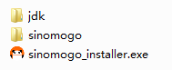

# <a id="title"></a>SINOMOGO SDK: GETTING STARTED GUIDE
## SDK INTEGRATION & API IMPLEMENTATION
Unity for Android "Amber Rat" Release

###1. ABSTRACT
---
This document is provided as a quick start guide to help you integrate the SinoMoGo SDK into your Android game or app and demonstrates how to you can use the SinoMoGo Pay (billing) and SinoMoGo Connect (social media sharing) plugins. 

**Notes:**
* This SDK is only intended for games and apps submitted and approved via [www.sinomogo.com] (http://www.sinomogo.com) (Smartions' Android Distriution as a Service platform for China) and requires a live SDK configuration specific to your game  or app.
* Please make sure that your Android package name (e.g. `com.company.application`) and the keystore used to sign your game or app remain consistent during development and publishing.
* To test the SDK integration with the test configuration files (test bin files), you need to run the signed APK on a physical device. The SDK will not function correctly with an unsigned APK in an emulator.
* Once integration with the SinoMoGo SDK is complete and before submitting your build for testing by our China QA team via [www.sinomogo.com] (http://www.sinomogo.com), run the "**SinoMoGoCheckFileTool.exe**" tool found in the [SinoMoGoCheck] (./SinoMoGoCheck) folder of this SDK package and resolve any reported issues. 

###2. ENVIRONMENT
---
####2.1. Target Platform
This SDK is compatible with Android 4.0 or above and Unity 3D 4.x or above.

####2.2. Debug Environment
This SDK does **NOT** work with Android emulator (AVD). Make sure you run the application on a real device during development. 

####2.3. Integration Workflow
Please review the following chart (_Fig 1._) to farmiliarize yourself with the integration workflow before you start. 

 _Fig. 1_ 

 

###3. SINOMOGO SDK INTEGRATION
---
####3.1. Run the SinoMoGo SDK Installer

Download this complete SDK package by navigating [here] (../) and selecting the Github "**Download Zip**" option.

> _**IMPORTANT!** BEFORE running the "**SinoMoGoInstaller**", please make sure that your Unity project contains the **AndroidManifest.xml** under the path "**<your project>\Assets\Plugins\Android\**", if not you can copy the **AndroidManifest.xml** from "**<your project>\Temp\StagingArea\AndroidManifest.xml**" AFTER first building the Android project in Unity (See Unity [Android Build Process] (http://docs.unity3d.com/Manual/android-BuildProcess.html) documentation)._ 

Inside [SinoMoGoInstaller] (./SinoMoGoInstaller) folder of this SDK package (_Fig 2._) you will find an integration tool named "**sinomogo_installer.exe**" (_Fig 3._) which will help you to integrate SinoMoGo SDK into your App.


The SinoMoGo installer performs the following actions:

 * It copies a number of required files (including 3rd party payment/sharing platform files) to your development folder.
 * It modifies AndroidManifest.xml file to include required configurations
  
  _Fig 2._
  
  
 * Click "Browse" and locate your project.

  _Fig 3._

  
 * Click "Install" to run the installer. 


####3.2. Configure your Unity Project

**3.2.1.** Add your game or app's Application class name (e.g. `SinoMoGoApplication` as follows) under the **`<application>`** tag of the "**AndroidManifest.xml**" file.

  ```xml 
 <application
        android:name="com.smartions.sinomogo.app.SinoMoGoApplication"
        android:icon="@drawable/icon"
        android:label="@string/app_name" >
 </application>
  ```
  
> _**Note:** If there is android code in your Unity project and any class inherited from the Application class, please move all .so library loading methods to the `onCreate` method of the main entry Activity (e.g. where the main entry Activity is `HomeActivity` as per the following example)._ 
  
  ```c#
	public class HomeActivity extends UnityPlayerActivity {
	@Override
		public void onCreate() {
			try{
		    //move all .so loading actions and functions here.
			}catch(Exception e) {}
		}
	}
  ```
**3.2.2.** 	The "**Customer.bin**" and "**SinoMoGo.bin**" are the SinoMoGo SDK Configuration (Config) files, these must be copied to the "**/Assets/Plugins/Android/assets/**" directory under your project. If you have not yet received an SDK Config file set sepcific to your game or app, you can use the Test SDK Config file set included in the SDK package by default to start.

To double-check that the install completed successfully, you can run the "SinoMoGoCheckFileTool.exe" tool found in the "SinoMoGoCheck" folder. This verifies the AndroidManifest.xml updates and that the necessary resources have been copied.
For further verification that the file copy is complete you can refer to [FileList.txt](./Documentation/FileList.txt).

> _**Note:** If the unlikely event that the installer fails or resources have not been copied correctly during installation, please refer to the [SinoMoGo Unity Android SDK - Manual Setup] (./Troubleshooting/SinoMoGo%20Unity%20Android%20SDK%20-%20Manual%20Setup.md) document for SDK manual setup steps._


###4. SINOMOGO PAY API USAGE
--- 
####4.1. Configure the Integration Prerequisites

 1. Check the properties of "**&lt;your project&gt;\Assets\Plugins\SinoMoGo\SinoMoGoPayManager.prefab**" and ensure that the "_Sinomogo Pay Manager (Script)_" is pointing to the "**SinomogoPayManager.cs**" file (_Fig 4._).

  _Fig 4._

 

 2. Place the **SinoMoGoPayManager.prefab** into the scene in order to receive transaction results sent via the SinoMoGo SDK (_Fig 5._).
  
  _Fig 5._

  

  > _**Note:** The file "SinoMoGoPayManager.prefab" need to be placed in just one scene. It is not necessary to place it in multiple scenes._
 
####4.2. Making a payment


 ```c#
	public static void purchase(string productId, int count)
 ```


|    Parameter           |                          Description                                                    |
|-----------------------|-----------------------------------------------------------------------------------------|
| **`productId`**	| In-App Purchase item product ID (IDs are contained in the  game or app specific "**SinoMoGo.bin**" file). Product IDs will be provided to you in the **Recommended Item Pricing** sheet as part of the guidance from the Smartions team.       |
| **`count`**	| Quantity of the item for this purchase (usually 1).              |


  The default **SinoMoGo.bin** SDK Configuration file (test version) contains all supported billing integrations and a total of 40 test products, priced from 1 to 40 RMB(元). Product IDs are formatted the following way:
  
  ```c#   
	com.smartions.sinomogo.test.product[x]
  ```
  The '**x**' is the number of the product, meaning **`com.smartions.sinomogo.test.product1`** is the first product and **`com.smartions.sinomogo.test.product40`** is the last product defined.

  The price of the test products conform to the following format:

  
|    ProductID          |      Price                        |
|-----------------------|-----------------------------------|
| com.smartions.sinomogo.test.product**1** | RMB 1  (元)  | 
| com.smartions.sinomogo.test.product**11** | RMB 11 (元)  | 
| com.smartions.sinomogo.test.product**40** | RMB 40 (元)  |  


You can reference these product IDs during test development as described in subsequent sections of this documentation. These test products can be used to verify if your SinoMoGoPay integrations are working correctly.

> _**Warning:** All payment performed by user or developer will be charged even when using the test SDK configuration. Please do **NOT** sign in to make any payments using any of the connected payment services as part of testing. This will result in a charge. Once integration is complete and the Payment UI is showing to the end user with no errors, you should be done. Smartions will also thoroughly test payments in China once you have completed integration._ 

Sample Code:

 ```c#
	void Start() {

	}
	void OnGUI(){
	   	//click buy button
		if( GUI.Button(new Rect(100,10,100,40), "Buy") ) {
			SinoMoGoPay.purchase("com.smartions.sinomogo.test.product1",1);
		}
	}
 ```
When the `purchase()` method is invoked, the payment modal UI with all available payment options will be displayed to the user (_Fig 6._ Alipay and UnionPay only in this example).

_Fig 6._


####4.3. Configure the SinoMoGoPayManager Object

The **SinoMoGoPayManager.cs** code found in the **SinoMoGoPayManager.prefab** that you added to the scene previously (section 4.1) contains the `PayResult` method. Here you should implement code inside this method to handle different payment results. E.g. to update your user's item or virtual currency balance where the purchase is successful.


The `PayResult` method can be found in the **SinoMoGoPayManager.cs**.

 ```c#
	void PayResult( string result )
 ```
 
> _**Result**: SinoMoGo SDK returns the payment result in JSON format. You must use the `SinoMoGoJson.SinoMoGoDeserialize()` method to convert the JSON string to `IDictionary` type in order to retrieve details within the payment result._

Payment result `IDictionary` properties:


|    Property           |                          Description                                                    |
|-----------------------|-----------------------------------------------------------------------------------------|
| **`RESULT_FLAG`**	| Indicates if the transaction was successful or not (Values: `True` or `False`).         |
| **`PRODUCT_ID`**	| The `PRODUCT_ID` property contains the product ID of the purchased item.                |
| **`PAY_WAY`**	        | Indicates which payment option the user selected in order to complete the transaction.  |
 

> _**Note**:  If the end user closes the SinoMoGo UI without choosing any of the payment options, the returned PAY_WAY value is `null`._

The following sample code shows how different actions can be defined based on different payment results. The `System.Enum.Parse()` method can be used to parse string parameters to `enum` values.
 
 ```c#
	public class SinomogoPayManager : MonoBehaviour{

		void PayResult(string result){
		IDictionary item =  (IDictionary) SinoMoGoJson.SinoMoGoDeserialize(result);
		bool resultflag = Convert.ToBoolean(item["RESULT_FLAG"]);
		string productid = Convert.ToString(item["PRODUCT_ID"]);
		string payway = item["PAY_WAY"] != null ? Convert.ToString(item["PAY_WAY"]) : null ;
		string message = "" ;
		if( payway != null ){
			PayWay way = (PayWay)System.Enum.Parse(typeof(PayWay),payway,false);
			switch(way)
			{
				case PayWay.alipayclient:
		                // Payment method is Alipay Mobile Client
				message = "AlipayClient";
				break;
				case PayWay.unionpay:
	                	// Payment method is UnionPay
	                	message = "UnionPay";
				break;
	 		}
		}
		message += " Transaction " + (resultflag ? " Successful " : " Failed " + ",PID: " + productid);
		Debug.Log( message);
		}
	}
 ```

###5. SINOMOGO CONNECT API USAGE
---
####5.1. Configure the Integration Prerequisites

 1. Check the properties of "**&lt;your project&gt;\Assets\Plugins\SinoMoGo\SinoMoGoConnectManager.prefab**" and ensure that the "_Sinomogo Connect Manager (Script)_" is pointing to the "**SinomogoConnectManager.cs**" file (_Fig 7._).
  
 _Fig 7._

 

 2. Place the **SinoMoGoConnectManager.prefab** into the scene in order to receive sharing results sent via the SinoMoGo SDK (_Fig 8._).
  
  _Fig 8._

  

  > _**Note:** The file "SinoMoGoPayManager.prefab" need to be placed in just one scene. It is not necessary to place it in multiple scenes._
 
####5.2. Sharing Content

The `shareAction()` method (within the `SinoMoGoConnect` object) can be used to share content across supported Chinese social networks and will display a modal UI with all available sharing options to the user (_Fig 9._ WeChat, Sina Weibo, Tencent Weibo, RenRen in this example).

_Fig 9._

  
  
See the following method description for the `shareAction()` method:  

 ```c#
	public static void shareAction(string content, byte[] data, byte[] wechatData, string snsType, string url)
 ``` 
 
 
|    Parameter          |                          Description                                                    |
|-----------------------|-----------------------------------------------------------------------------------------|
| **`content`**	        | String type. The content to be shared.                                                  |
| **`data`**	| Path to the image to be shared on Sina Weibo, Tencent Weibo, and RenRen social networks. Set to null if you don't want to share any image. Must be a local image from the device or a URL for an online image. We recommend 640*640 images with a maximum size of 1MB.             |
| **`wechatData`**	| Path to the image to be shared on WeChat. Must be a local icon image from the device or a URL for an online image. We recommend using 72*72 image with a maximum size of 32KB.              |
| **`snsType`**	| Platform to which the content will be posted (see following table).               |
| **`url`**	| URL of a web site which is linked in sharing. This URL will be provided to you in your game or app guidance report or by the Smartions team. **Null value not allowed**.   |  


The `snsType` parameter in the code above can be used to target specific Chinese social networks:


|    snsType          |                          Description                                                    |
|-----------------------|-----------------------------------------------------------------------------------------|
|    `SNSType.ALL`        |    Display all sharing options to the user (defined in SinoMoGo.bin).                    |
|    `SNSType.SINA`         |  Sharing via Sina Weibo only.                                                   |
|    `SNSType.TENCENT`       |    Sharing via Tencent Weibo only.                                                  |
|    `SNSType.RENREN`        |    Sharing via RenRen only.                                                   |
|    `SNSType.FRIEND`        |    Sharing with a particular WeChat friend or friend group chat.                       |
|    `SNSType.GROUP`          |   Sharing on WeChat via "WeChat Moments" (similar to Facebook wall).    |

> _**Note**: Unless otherwise directed by the Smartions team in your game or app Guidance Report, `SNSType.ALL` should be used in all sharing points within your game or app to enable the user to select their prefered social network._ .

Sample Code:

 ```c#
	public Texture2D shareData;
	public Texture2D wechatData;
	void Start(){
	    
	}
	void OnGUI(){
		 //click allShare button
		 if( GUI.Button(new Rect(10,10,100,40), "allShare") ) {
	 	SinoMoGoConnect.shareAction("This is a test", encode(), wechatEncode(), SNSType.ALL, "http://www.sinomogo.com");
		 }
	 	//click sinaShare button
	 	if( GUI.Button(new Rect(100,60,100,40), "sinaShare") ) {
			SinoMoGoConnect.shareAction("This is a test", encode(), wechatEncode(), SNSType.SINA, "http://www.sinomogo.com");
	 	}
	 	//click friendShare button
  		if( GUI.Button(new Rect(100,120,100,40), "friendShare") ) {
			SinoMoGoConnect.shareAction("This is a test", encode(), wechatEncode(), SNSType.FRIEND, 	"http://www.sinomogo.com");
 	  	}
	}
	private byte[] encode(){
     		return shareData.EncodeToPNG();
	}
	private byte[] wechatEncode(){
		return wechatData.EncodeToPNG();
	}
 ``` 
####5.3. Configure the SinoMoGoConnectManager object

The **SinoMoGoConnectManager.cs** within the **SinoMoGoConnectManager.prefab** file that you added to the scene previously (section 5.1) contains the "`ShareResult`" method. You can implement appropriate code inside the `SinoMoGoConnectManager` class and `ShareResult` method to handle different sharing results.

 ```c#
	void ShareResult (string result)
 ```
 
> _**Result**: SinoMoGo SDK returns the sharing result in JSON format. You must use the `SinoMoGoJson.SinoMoGoDeserialize()` method to convert the JSON string to `IDictionary` type in order to retrieve details within the sharing result._

Sharing result `IDictionary` properties:

|    Property          |                          Description                                                    |
|-----------------------|-----------------------------------------------------------------------------------------|
|    `SHARE_FLAG`        |    Result flag which indicates if the share was successful or not. (Values: `True` or `False`).                    |
|    `SHARE_TYPE`         |  Indicates the platform the user selected for the share.    | 


> _**Note**:  If the end user closes the SinoMoGo UI without choosing any of the sharing options, the returned `SHARE_TYPE` value is `null`._ 

The `System.Enum.Parse()` method can be used to parse string parameters to `enum` values. Please refer to the following sample code:

 ```c#
	public class SinomogoConnectManager:MonoBehaviour
	{
	
		void ShareResult(string result) {
			IDictionary item = (IDictionary) SinoMoGoJson.SinoMoGoDeserialize(result);
			bool resultflag = Convert.ToBoolean(item["SHARE_FLAG"]);
			string sharetype = item["SHARE_TYPE"] != null ? Convert.ToString(item["SHARE_TYPE"]) : null;
			string message = "";
			if (sharetype != null) {
				ShareType type = (ShareType) System.Enum.Parse(typeof(ShareType), sharetype, false);
				switch (type) {
				case ShareType.sina:
					// Sina Weibo
					message = "Sina";
					break;
				case ShareType.tencent:
	
					// Tencent Weibo
					message = "Tencent";
					break;
				case ShareType.renren:
					// RenRen
					message = "RenRen";
					break;
				case ShareType.friend:
					message = "Wechat friend";
					// WeChat friend
					break;
				case ShareType.group:
					message = "Wechat moments";
					// WeChat moments
					break;
				}
			}
			message += " Sharing " + (resultflag ? " Successful " : " Failed ");
			Debug.Log(message);
		}
	}
 ```
 
###6. SINOMOGO EXCEPTION CODE LIST 
---
 
 
|    Exception Code         |      Exception Description (English)         |异常描述 (简体中文)|
|-----------------------|-----------------------------------|-----------------------------------|
|   10001         |      Your SinoMoGo Key is null or invalid. Please contact Smartions technical support.        | SinoMoGo.bin没有配置APPId或APPId无效。请联系斯曼森信息技术公司技术支持人员 |
|    10002         |   The `PayUI(Activity)` is not configured in the AndroidManifest.xml         | `PayUI(Activity)`没有在AndroidManifest.xml中注册 |
|    10003         |      The SinoMoGo.bin file is not configured correctly, please contact Smartions technical support.        | SinoMoGo.bin配置错误,请联系斯曼森信息技术公司技术支持人员。 |
|    10004         |      Resource Missing: SinoMoGo SDK Image is not found, please contact Smartions technical support.         | 资源缺失:SDK图片不存在,请联系斯曼森信息技术公司技术支持人员 |
|    10005         |      `ProductId` is invalid       | 商品ID参数错误|
|   10007        |      Invalid verification value (MD5)       | 无效校验码 (MD5) |
|    10008        |      Verification failed (Error in SinoMoGo.bin file content)      | 验签失败(SinoMoGo.bin文件内容有错) |
|    11001         |    The `AlipayUI(Activity)` is not configured on AndroidManifest.xml         | `AlipayUI(Activity)`没有在AndroidManifest.xml中注册 |
|    14001        |      File Resource Missing:China UnionPay SDK is not found         | 文件资源缺失：中国银联 SDK不存在 |
|    20001        |      Your SinoMoGo Key is null or invalid. Please contact Smartions technical support.         | SinoMoGo.bin没有配置AppId或AppId无效。请联系斯曼森信息技术公司技术支持人员 |
|    20002        |	The ShareActivity(Activity) is not configured in AndroidManifest.xml        |	ShareActivity(Activity)没有在AndroidManifest.xml中注册        |
|    20003        |	The ShareUI(Activity) is not configured in AndroidManifest.xml        |	ShareUI(Activity)没有在AndroidManifest.xml中注册        |
|    20004        |	Resource Missing: SinoMoGo SDK Image is not found, please contact Smartions technical support.      |	资源缺失:SDK图片不存在,请联系斯曼森信息技术公司技术支持人员        |
|    20005        |	The SinoMoGo.bin file is not configured correctly, please contact Smartions technical support.    |	SinoMoGo.bin配置错误,请联系斯曼森信息技术公司技术支持人员。        |
|    20007        |	Invalid verification value (MD5)        |	无效校验码 (MD5)        |
|    20008        |  Verification failed (Error in SinoMoGo.bin file content)  |  验签失败(SinoMoGo.bin文件内容有错)    |
|    21001        |	The link address sharing with Wechat can't be empty     | 微信分享链接地址不能为空        |

