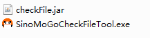
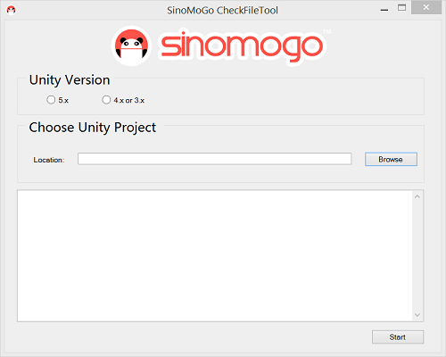
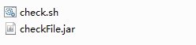

# <a id="title"></a>SINOMOGO SDK FILE CHECKER
## Unity for Android


The SinoMoGo SDK File Checker is a tool which helps to verify that all required files are present and in the correct location after the SinoMoGo SDK integration has been completed as well as verify the AndroidManifest.xml configuration. 

####Windows 
Where your development environment is Windows, use the "**SinoMoGoCheckFileTool.exe**" file found in the [Windows] (./windows) sub-directory (_Fig 1._).

 _Fig 1._ 

  
 
The SinoMoGo SDK File Checker tool interface ( _Fig 2._ ):
 
 _Fig 2._ 

  
 
- Select your version of Unity3D which your project used.
- Click the "**Browse**" button and select your project folder (which already has the SinoMoGo SDK integrated).
- Click the "**Start**" button to start the checking process.
- A successful pass will display the message "**Checking completed, no errors found**".
- In case there are errors reported ("**Not configured**", "**Not found**" messages) please check the log against the [FileList.txt (Unity3D 3.x, Unity3D 4.x)] (../Documentation/FileList.txt) or [FileList.txt(Unity3D 5.x)] (../Documentation/FileList5.txt) and amend any errors by copying the missing files to their correct location.

###Linux

Where your development environment is Linux, use the resources found in the [Linux] (./linux) sub-directory (_Fig 3._).

_Fig 3._

  


Open terminal and if your version of Unity3D is 5.x please execute the following command with appropriate user permission:
   
  ```xml
  sh "**./<shellPath>/check.sh**" "**./<projectPath>**".
  ``` 

If your version of Unity3D is 3.x or 4.x please use the following command:
   
  ```xml
  sh "**./<shellPath>/check4.sh**" "**./<projectPath>**".
  ``` 


"**&lt;shellPath&gt;**" must be the location where `check.sh` or `check4.sh` resides and "**&lt;projectPath&gt;**" should be your game or app's project path.

- A successful pass will display the "**Configuration OK!**" and "**File OK!**" messages.
- In case there are errors reported ("**Not configured**", "**Not found**" messages) please check the log against the [FileList.txt(Unity3D 3.x, Unity3D 4.x)] (../Documentation/FileList.txt) or [FileList.txt(Unity3D 5.x)] (../Documentation/FileList5.txt) and amend any errors by copying the missing files to their correct location.
